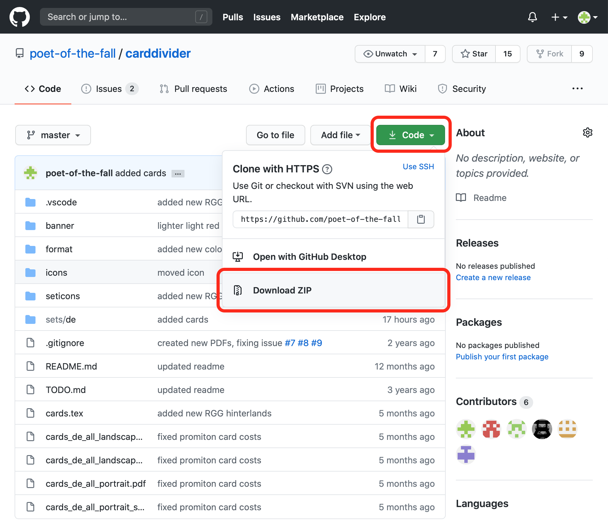
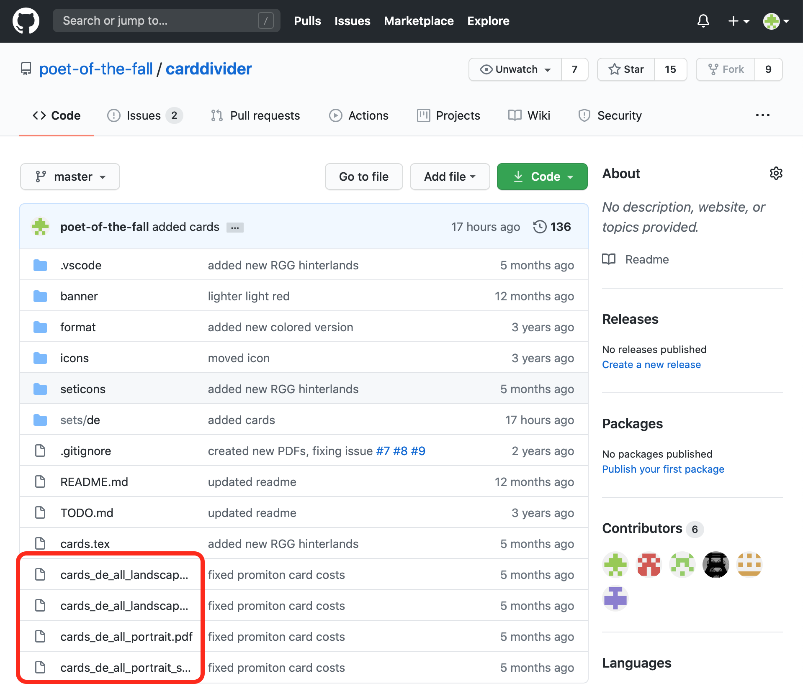
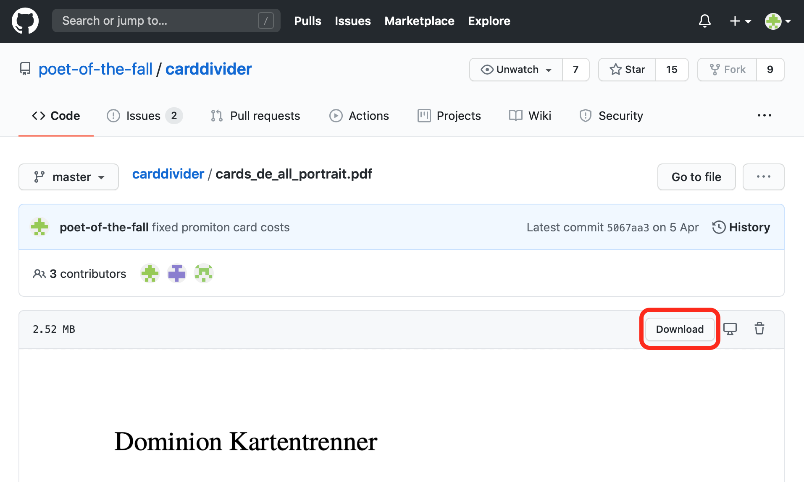

# Dominion Card Divider

This card dividers can be used if you plan to pack your Dominion sets into a box or suitcase and want to stack them.

It is based on the works of Eiko Wagenknecht ([visit his website](http://www.phenx.de/dominion-kartentrenner/)) and contains all of his card dividers now set in LaTeX as well as all of the current sets offered by Rio Grande Games with the instructions offered on their [website](http://www.dominion-welt.de/support/downloads/).

To compile the card dividers you need a Latex distribution. To read more about this, you can start [here](https://www.latex-project.org/get/#distributions).

You will also need to download the TrajanPro font. See these two links: [Regular](http://fontsgeek.com/fonts/Trajan-Pro-Regular), [Bold](http://fontsgeek.com/fonts/Trajan-Pro-Bold)

**Feel free to add further card sets, editions, languages or formats or correct some errors or typos. To do so fork the project and open a pull request or use the issues section if you aren't familiar with LaTex and/or Github.**

## Download the PDFs

For those of you who are not familiar with Github here some short words on where to find the PDFs and how to download them.

### Get all

You can copy the whole project and download it as a `.zip` file by clicking on **Code** and **Download ZIP**. You can then extract it on your computer and will find the PDFs directly in the folder you extracted.



### Get one

You can also select just the one you want. Simply click the one you like either in the files list above or in the following list and then the **Download** button on the page that opens. Available styles:

- [Black Portrait](cards_de_all_portrait.pdf)
- [Setcolor Portrait](cards_de_all_portrait_setcolor.pdf)
- [Black Landscape](cards_de_all_landscape.pdf)
- [Setcolor Landscape](cards_de_all_landscape_setcolor.pdf)




## Printing the PDF

You can read more about the different ideas on how to print the card dividers on Eikos [website](http://www.phenx.de/dominion-kartentrenner/). I personally print them on A4 self-adhesive paper like [these](https://www.avery-zweckform.com/produkt/universal-etiketten-l4735rev-100) and stick it onto thick black cardboards like [these](https://www.amazon.de/Folia-614-50-90-Fotokarton/dp/B000OZN29C/ref=pd_lpo_vtph_229_lp_tr_t_2?_encoding=UTF8&psc=1&refRID=QXMVJYTY91CVWSV4WC7V).

**Remember that your printer setting may scale the output**. For my use case, this is absolutely fine, as the cut output is nearly the same with as the Dominion cards and fits perfectly into my box. If you want the slightly bigger ones, set the no-scaling-option before you print it.

## Compiling the PDFs

You can use TexStudio or some other editor to edit the files and compile the PDFs. Remember to change your standard compiler to *lualatex* if you compile the PDFs with your editor.

For this project I gave [Visual Studio Code](https://code.visualstudio.com) a try. I used the *Latex Workshop* extension for the LaTeX stuff (it auto compiles the project on saving with the given settings in the root file head comment). For spell checking I installed *Code Spell Checker* and the *German - Code Spell Checker* extensions and updated the ```.vscode/settings.json``` accordingly.

If you only need some of the sets in your PDF just comment out the sets you don't need and compile exactly the version you need.

## Tarot addition

Convert the export to PNG with ImageMagick:

```
magick convert -density 300x300 -verbose cards-tarot.pdf ./cards/card.png
```

Current Cards can be shown and downloaded on my [Adobe Album](https://adobe.ly/2VE9PHV).

## Portrait, Landscape and other formats

To switch between the portrait and landscape mode take a look at ```cards.tex``` in the root folder. Watch for these lines:

```latex
% Draw cards in portrait format
\input{format/blackportrait.tex}
% \input{format/setcolorportrait.tex}
% Draw cards in landscape format
% \input{format/blacklandscape.tex}
% \input{format/setcolorlandscape.tex}
```

Uncomment the version you want to use and comment out the other one.

## Global variables

Currently there is one variable defined in the ```cards.tex``` that is meant to be used globally.

- showSetIcon: toggle showing the set icon on the dividers

## Set variables

Some variables are defined in the ```cards.tex``` and are overwritten in each set.

- cardcolor: color for the card set (used for the stripe or the card background itself)

- cardextension: text and number for the extension (used on top right of the cards)

- cardextensiontitle: the title of the extension (on the top right of the card directly below the cardextension)

- seticon: file name of the icon of the card set (without the path as this is set in the format definition)

## Color definition

The main colors are defined in the ```cards.tex```.

- framebg: normally used color for the background of the whole card

- contentbg: normally used color for the background of the content area (containing the instruction text) of the card

Further defined colors for the card sets:

- basicgame
- intrigue
- seaside
- alchemy
- prosperity
- cornucopia
- hinterlands
- darkages
- guilds
- adventures
- empires
- nocturne
- renaissance
- menagerie
- promo

## Shortcuts / defined commands

The ```format/_shortcuts.tex``` defines some frequently used commands to use them as a shortcut.

- coin (  
): Takes one optional argument and draws a coin containing the text of the given argument (usage: ```\coin[2]``` draws a coin containing a "2", ```\coin``` draws an empty one).

- hex(  
): Takes one optional argument and draws a hex containing the text of the given argument (usage: ```\hex[1]``` draws a hex containing a "1", ```\hex```draws an empty one).

- victorypointtoken(  
): Draws a victory point token (the one containing with a "1" on it, usage: ```\victorypointtoken```). 

- victorypoint(  
): Draws a victory point icon (usage: ```\victorypoint```). 

- potion(  
): Draws a potion (like used in alchemy, usage: ```\potion```). 

- negativecardmarker(  
): Can be used to draw the negative point marker of the adventures extension (usage: ```\negativecardmarker```). 

- negativecoinmarker(  
): Can be used to draw the negative coin marker of the adventures extension (usage: ```\negativecoinmarker```). 

## The card commands

A card can be defined by using the following commands within the tikzpicture environment:

- card: Draws an empty card (background, content area, title, set icon and cut marks).

- cardstrip: Draws the strip with the cardcolor to the card

- cardbanner: Takes one argument containing the banner icon file.

- cardicon: Takes one argument containing the icon used on the banner.

- cardprice: Takes one argument and writes it as text onto the cardicon.

- cardiconaddition: Takes one argument and draws another icon besides the first one.

- cardpriceaddition: Takes one argument and writes it as text onto the additional icon.

- cardtitle: Takes one argument and writes it as text onto the card banner.

- cardcontent: Takes one argument and writes it as text onto the content area.
